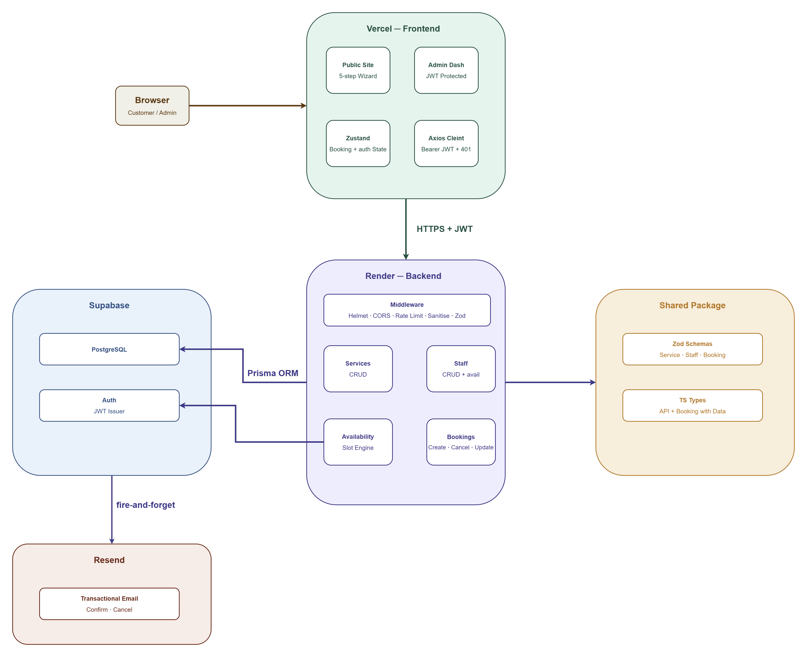

# Luxe Hair Studio — Full-Stack Service Booking System

A production-deployed, end-to-end appointment booking platform built for a premium hair salon. This project covers the full product lifecycle — database design, REST API architecture, customer-facing UI, transactional email, and a secure admin dashboard — deployed and live.

**Live site:** [luxe-hair-studio-frontend.vercel.app](https://luxe-hair-studio-frontend.vercel.app)  
**API health:** [luxe-hair-studio-api.onrender.com/health](https://luxe-hair-studio-api.onrender.com/health)  
**Repo:** [github.com/AhmedIsmailKhalid/Luxe-Hair-Studio](https://github.com/AhmedIsmailKhalid/Luxe-Hair-Studio)

---

## The Problem

Small service businesses — salons, spas, studios — typically land in one of two situations: they're paying for a bloated SaaS platform that doesn't fit their brand, or they're still taking bookings over the phone and Instagram DMs. Neither is great. Generic platforms force businesses into someone else's UX. Manual bookings don't scale, create double-booking risk, and send no confirmations.

This project is what a purpose-built alternative looks like: a booking system designed around how a real hair salon actually operates — multiple stylists, each with their own schedule and service specialisations, with customers guided through a clear step-by-step flow and automatically notified by email.

---

## What It Does

**For customers:**
- Browse services with pricing, duration, and category filtering
- View stylist profiles, specialties, and the services each stylist offers
- Book through a 5-step guided wizard: service → stylist → date/time → personal details → confirmation
- Receive an automated email confirmation immediately after booking
- Deep-link directly to a specific service or stylist from any page

**For the business:**
- Secure admin dashboard behind JWT authentication
- Full booking management — view all bookings, filter by status and date, update statuses, cancel
- Service management — create, edit, toggle active/inactive, delete
- Staff management — manage profiles, weekly availability schedules, and service assignments
- Smart delete logic — preserves historical data when bookings exist, cleans up fully when they don't

---

## Technical Highlights

**Monorepo with shared types** — Zod schemas live once in a `shared/` package consumed by both the backend (API validation) and the frontend (form validation). A type mismatch between the two sides is a compile error, not a runtime surprise.

**Availability engine with race condition prevention** — Slot availability is calculated from staff working hours and filtered against existing bookings. It is checked twice: when the user browses available slots, and again at the exact moment of booking creation. This prevents two users from claiming the same slot in the window between their availability query and their form submission.

**Layered backend security** — Every public route has IP-based rate limiting (100 req / 15 min). The booking creation endpoint has an additional stricter limiter stacked on top (10 req / hr). All free-text client input is sanitised to strip HTML tags and entities before persistence. CORS is locked to the production frontend domain only.

**Fire-and-forget email** — Confirmation and cancellation emails are sent via Resend but intentionally not awaited. If the email provider is unavailable, the booking still succeeds. The failure is logged without surfacing to the user.

**JWT on both sides** — Supabase Auth handles the frontend session. The backend service role client independently verifies the JWT on every protected request without trusting frontend session state. The Axios client attaches tokens automatically and handles 401s globally.

**Bundle performance** — The Vite frontend is split into vendor chunks via `manualChunks` — React, state, forms, utilities, and UI primitives are cached separately from application code. Return visitors only re-download what changed.

---

## Tech Stack

| Layer | Technology |
|---|---|
| Frontend framework | React 18 + Vite + TypeScript |
| Styling | Tailwind CSS v3 with custom design tokens |
| UI primitives | shadcn/ui (Radix UI) |
| Routing | React Router v6 |
| Global state | Zustand |
| Forms & validation | React Hook Form + Zod |
| HTTP client | Axios with interceptors |
| Backend framework | Node.js 22 + Express + TypeScript |
| ORM | Prisma v5 |
| Database | PostgreSQL via Supabase |
| Authentication | Supabase Auth (JWT) |
| Transactional email | Resend |
| Logging | Winston |
| Shared validation | Zod (monorepo shared package) |
| Frontend deployment | Vercel |
| Backend deployment | Render |
| Uptime monitoring | UptimeRobot |

---

## Architecture



At a high level: the React frontend is deployed on Vercel and communicates with an Express REST API on Render via authenticated Axios requests. The backend validates all inputs with Zod, applies rate limiting, sanitises client data, and persists to a PostgreSQL database via Prisma. Supabase handles both the database hosting and JWT-based admin authentication. Resend handles transactional email on a fire-and-forget basis.

---

## Project Structure

```
├── frontend/               # React + Vite — public site and admin dashboard
│   ├── src/
│   │   ├── components/     # UI primitives, layout, booking wizard, admin
│   │   ├── pages/          # Public pages + admin pages
│   │   ├── hooks/          # useServices, useStaff, useAvailability
│   │   ├── store/          # Zustand — auth and booking wizard state
│   │   ├── lib/            # API functions, utilities
│   │   └── config/         # Axios instance, Supabase client, env validation
│   └── vercel.json         # React Router rewrite rules
│
├── backend/                # Express REST API
│   ├── src/
│   │   ├── controllers/    # Services, staff, availability, bookings
│   │   ├── routes/         # Route definitions
│   │   ├── middleware/     # Auth, rate limiting, error handling, logging
│   │   ├── services/       # Availability engine, email service
│   │   ├── lib/            # Prisma, Supabase, Resend, Winston singletons
│   │   └── config/         # Zod env validation on startup
│   └── prisma/
│       ├── schema.prisma   # 5 models: Service, Staff, StaffService,
│       │                   # StaffAvailability, Booking
│       └── seed.ts         # 8 services, 2 staff, full availability setup
│
└── shared/                 # Consumed by both frontend and backend
    └── src/
        ├── schemas/        # Zod schemas — service, staff, booking
        └── types/          # API response shapes, booking detail types
```

---

## Data Model

Five Prisma models covering the core domain:

- **Service** — name, description, duration, price, category, active flag
- **Staff** — profile, bio, active flag
- **StaffService** — join table mapping which staff offer which services
- **StaffAvailability** — per-day start/end times per staff member
- **Booking** — client details, service, staff, datetime, status, price snapshot

The availability engine queries `StaffAvailability` for working hours, generates all possible 30-minute slots, then subtracts any already covered by an existing `Booking` with status `confirmed` or `pending`.

---

## Running Locally

**Prerequisites:** Node.js 22+, a Supabase project, a Resend account

```bash
git clone https://github.com/AhmedIsmailKhalid/Luxe-Hair-Studio.git
cd Luxe-Hair-Studio
npm install

cp backend/.env.example backend/.env
# Fill in: DATABASE_URL, SUPABASE_URL, SUPABASE_SERVICE_ROLE_KEY,
#          SUPABASE_ANON_KEY, SUPABASE_JWT_SECRET, RESEND_API_KEY, RESEND_FROM

cp frontend/.env.example frontend/.env
# Fill in: VITE_API_URL, VITE_SUPABASE_URL, VITE_SUPABASE_ANON_KEY

npm run db:migrate --workspace=backend
npm run db:seed --workspace=backend
npm run dev
```

| Service | URL |
|---|---|
| Frontend | http://localhost:5173 |
| Backend API | http://localhost:3001 |
| Admin dashboard | http://localhost:5173/admin |
| Prisma Studio | http://localhost:5555 |

---

## Deployment

| Service | Platform | URL |
|---|---|---|
| Frontend | Vercel | luxe-hair-studio-frontend.vercel.app |
| Backend | Render (free tier) | luxe-hair-studio-api.onrender.com |
| Database | Supabase | Hosted PostgreSQL (session pooler) |
| Email | Resend | bookings@fueontaame.resend.app |
| Uptime monitoring | UptimeRobot | Pings /health every 14 min |

> The backend runs on Render's free tier which spins down after inactivity. UptimeRobot pings `/health` every 14 minutes to prevent cold starts.
